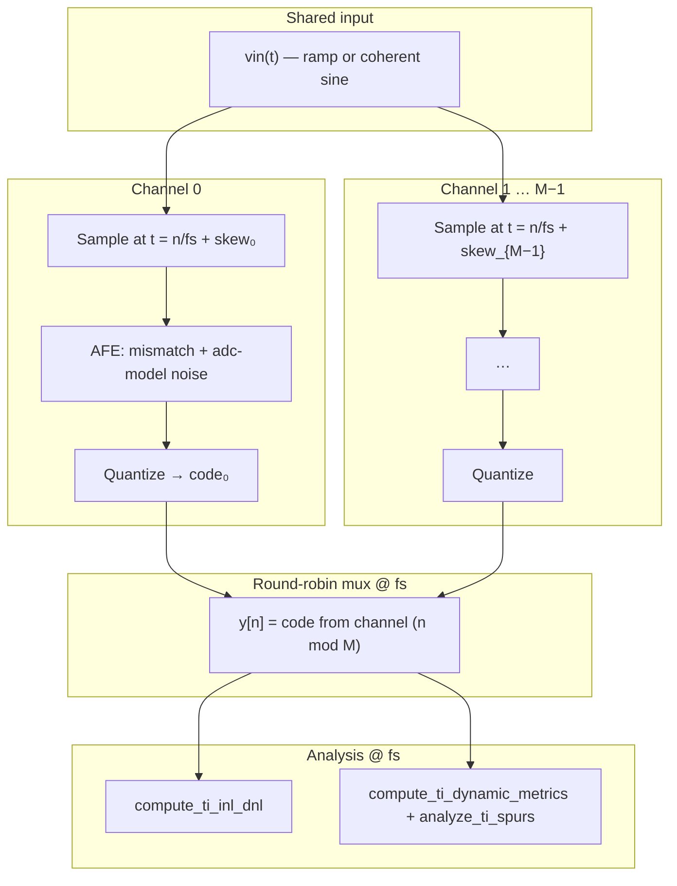
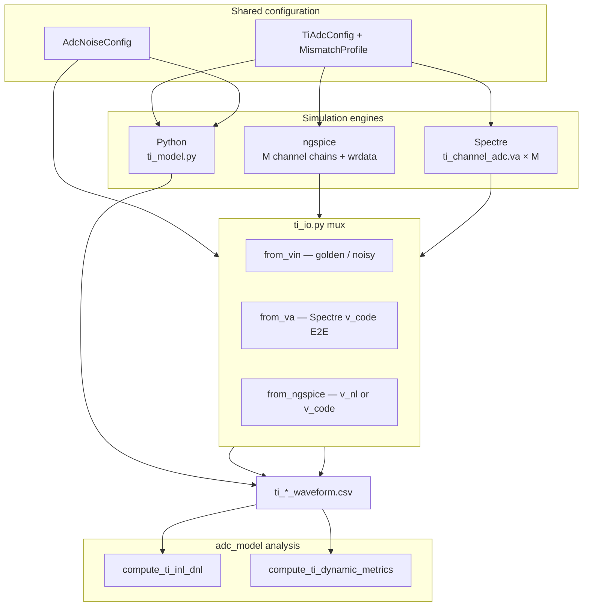

# TI ADC Behavioral Model Reference

This document describes how the **time-interleaved (TI) ADC** behavioral model is defined, simulated, and analyzed in **ti-adc-model**. For installation, CLI usage, batch scripts, and engine selection, see [README.md](README.md). **MODEL.md** is the deep modeling reference: mux timing, per-channel mismatch, testbenches, spur locations, and multi-engine behavior.

The Python implementation in `src/ti_adc/` builds on the single-channel package **adc-model** ([`MODEL.md`](model/adc-model/MODEL.md), [`veriloga/configurable_adc.va`](model/adc-model/veriloga/configurable_adc.va)). Per-channel wrappers are in [`veriloga/ti_channel_adc.va`](veriloga/ti_channel_adc.va). Post-simulation metrics reuse adc-model (`compute_inl_dnl`, `compute_dynamic_metrics`) on the **muxed output stream** at rate `fs`.

---

## Overview

The model represents an **M-channel time-interleaved ADC** at the behavioral level:

- **Per-channel analog front end:** static gain, offset, and **timing skew** (sample-phase error); optional calibration; shared per-channel noise from adc-model (jitter, thermal, nonlinearity, DNL spread).
- **Sub-ADC rate:** each channel samples at `fs/M` with phase `k/(M·fs) + TIMING_SKEW_S[k]`.
- **Mux output:** round-robin digital stream `y[n]` at rate `fs` (one sample per mux period `1/fs`).

Two standard testbenches drive characterization:

| Testbench | Stimulus | Primary metrics | Entry points |
| --- | --- | --- | --- |
| **Static** | Slow ramp on muxed input | INL, DNL on `y[n]` | `simulate_ti_static()` in [`src/ti_adc/ti_model.py`](src/ti_adc/ti_model.py), `scripts/run_ti_static.py` |
| **Dynamic** | Coherent full-scale sine | SNDR, SFDR, THD, ENOB, TI spurs at `k·fs/M` | `simulate_ti_dynamic()` in [`src/ti_adc/ti_model.py`](src/ti_adc/ti_model.py), `scripts/run_ti_dynamic.py` |

Configuration: [`src/ti_adc/config.py`](src/ti_adc/config.py), [`src/ti_adc/mismatch.py`](src/ti_adc/mismatch.py). Analysis wrappers: [`src/ti_adc/analysis.py`](src/ti_adc/analysis.py). Engine mux helpers: [`src/ti_adc/ti_io.py`](src/ti_adc/ti_io.py).

---

## Relationship to adc-model and Verilog-A

| Layer | adc-model | ti-adc-model |
| --- | --- | --- |
| Quantizer + noise | `configurable_adc.va` / `AdcConfig` + `AdcNoiseConfig` | Same chain **per channel** at mux instants |
| Sample rate | `fs` | Mux `fs`; channel `fs/M` |
| Extra impairments | — | Per-channel `gain[k]`, `offset_v[k]`, `timing_skew_s[k]` |
| VA module | `configurable_adc` | `ti_channel_adc` (wraps `configurable_adc`) |

**Per-channel processing order** (when noise is enabled) matches adc-model:

> jitter → gain/offset (mismatch) → A2/A3 → thermal → DNL → quantize

Timing **skew** is applied by evaluating the input waveform at `t_sample = n/fs + timing_skew_s[k]` (with optional `timing_cal_s[k]` when `enable_cal`). This is **distinct** from aperture **jitter** inside `configurable_adc` / `apply_analog_front_end_at_edges`.

[`veriloga/ti_channel_adc.va`](veriloga/ti_channel_adc.va) passes per-channel `GAIN`, `OFFSET_V`, noise parameters, and calibration into one `configurable_adc` instance per channel. Spectre testbenches use **four phase-shifted clocks** (`period = M/fs`, `delay = k/fs + timing_skew_k`). Python mux logic aligns exports to the uniform grid `t[n] = n/fs`.

---

## TI architecture



**Channel index** for mux sample `n`:

\[
k(n) = n \bmod M
\]

**Ideal sample time** (before skew):

\[
t_{ideal}(n) = \frac{n}{f_s}
\]

**Effective sample time** on channel `k`:

\[
t_{sample}(n,k) = t_{ideal}(n) + \text{timing\_skew\_s}[k] - \text{timing\_cal\_s}[k] \quad (\text{if } \texttt{enable\_cal})
\]

Input voltage at that instant: linear interpolation of `vin(t)` on the mux time grid (dynamic) or dense simulator grid (Spectre/ngspice export).

---

## Per-channel mismatch

### Static arrays (`TiAdcConfig`)

| Field | Unit | Description |
| --- | --- | --- |
| `gain[k]` | — | Multiplicative gain before quantizer |
| `offset_v[k]` | V | Additive offset (input-referred) |
| `timing_skew_s[k]` | s | Extra sample delay vs ideal phase `k/(M·fs)` |
| `gain_cal[k]`, `offset_cal_v[k]`, `timing_cal_s[k]` | — | Correction when `enable_cal` |

**Effective voltage** (ideal path, no adc-model noise):

\[
v_{eff} = G_k \cdot v_{in}(t_{sample}) + V_{offset,k}
\]

With calibration:

\[
v_{eff} \leftarrow \frac{v_{eff} - V_{offset,cal,k}}{G_{cal,k}}
\]

Implemented in [`_apply_channel_front_end`](src/ti_adc/ti_model.py) and [`_vin_at_mux_instant`](src/ti_adc/ti_io.py).

### Staggered presets ([`src/ti_adc/config.py`](src/ti_adc/config.py))

`staggered_mismatch()` linearly steps mismatch across channels (ch0 lowest, ch\(M-1\) highest):

| Preset | Function | Typical span (M=4) |
| --- | --- | --- |
| `ideal` | `preset_ideal()` | All unity / zero |
| `gain` | `preset_gain_mismatch()` | ~±1 % gain span |
| `offset` | `preset_offset_mismatch()` | ~±20 mV offset span |
| `clock` / `skew` | `preset_skew_mismatch()` | ~±200 ps skew span |
| `combined` | `preset_combined_impaired()` | gain + offset + skew |

CLI `--impairment` maps `clock` → internal `skew`.

### Time-varying overlay (`MismatchProfile`)

Static `TiAdcConfig` arrays are the baseline. When `kind == TIME_VARYING`, a modulation factor in \([-1, 1]\) scales drift amplitudes:

\[
G_k(n) = G_k \cdot (1 + m(n,k) \cdot \Delta G_k)
\]
\[
V_{offset,k}(n) = V_{offset,k} + m(n,k) \cdot \Delta V_k
\]
\[
\text{skew}_k(n) = \text{skew}_k + m(n,k) \cdot \Delta t_k
\]

Waveforms for \(m\): **sinusoid** (`sin(2\pi f_{drift} t + \phi_k)`), **ramp**, or **step** at `step_sample`. See [`effective_mismatch`](src/ti_adc/mismatch.py).

---

## Per-channel ADC noise (adc-model)

When `AdcNoiseConfig.enabled`, each mux sample uses the channel’s effective `gain` / `offset_v` in a temporary `AdcConfig`, then [`apply_analog_front_end_at_edges`](model/adc-model/src/adc_model/noise.py) with shared `noise_seed` and `dt = 1/fs`.

See [adc-model MODEL.md — Signal chain](model/adc-model/MODEL.md#signal-chain-and-processing-order) for jitter, A2/A3, thermal, and DNL equations.

**Ideal TI path** (`--ideal`): `AdcNoiseConfig` all zero; only mismatch (if preset non-ideal) and quantizer.

---

## Mux output stream

| Quantity | Symbol / code | Default (suite) |
| --- | --- | --- |
| Mux rate | `fs_hz` | 1 GHz |
| Channels | `num_channels` (M) | 4 |
| Channel rate | `channel_fs_hz = fs/M` | 250 MHz |
| Resolution | `bits` | 10 |
| Coherent tone | `fin_hz` | \(997 \cdot f_s / N\) ≈ 121.704 MHz |

**Digital output** on the mux bus:

\[
y_{code}[n] = \text{code}[n] \cdot \text{LSB}, \qquad \text{LSB} = \frac{V_{REFP} - V_{REFN}}{2^{BITS} - 1}
\]

Dynamic capture: **new code every mux clock** (`n = 0 … N-1`).

Static capture: **sample-and-hold** on the mux stream — `code[n]` updates only when the instantaneous quantized bin **changes** (same policy as adc-model ideal static). Noisy static bumps `samples_per_code` to **16** when noise is enabled.

---

## Coherent input tone (dynamic testbench)

For capture length \(N\) at mux rate \(f_s\), integer bin \(k\):

\[
f_{in} = k \cdot \frac{f_s}{N}
\]

\[
v_{in}(t) = v_{mid} + A \sin(2\pi f_{in} t), \quad A = 0.95 \cdot \frac{V_{fs}}{2}
\]

Default \(k = 997\), \(N = 8192\), \(f_s = 1\,\text{GHz}\) ⇒ \(f_{in} \approx 121.704\,\text{MHz}\).

**Important:** FFT and spur analysis use **mux rate** \(f_s\), not \(f_s/M\). Channel sampling appears as images in the muxed spectrum.

---

## TI mismatch spurs (dynamic)

Offset and gain mismatch between channels create spectral tones at multiples of the **channel sample rate**:

\[
f_{spur,k} = k \cdot \frac{f_s}{M}, \quad k = 1, 2, \ldots
\]

[`mismatch_spur_frequencies`](src/ti_adc/analysis.py) labels these `fs/M x k`. [`analyze_ti_spurs`](src/ti_adc/analysis.py) searches FFT magnitude near each tone (± `bin_tolerance` bins, default 2).

With \(f_s/M = 250\,\text{MHz}\), the first image is at **250 MHz** (often dominant under gain/offset impairment). Ideal runs may show a small residual near `fs/M` from finite capture.

Dynamic metrics (SNDR, SFDR, THD, ENOB) are **identical formulas** to adc-model via [`compute_ti_dynamic_metrics`](src/ti_adc/analysis.py) → `compute_dynamic_metrics` on muxed codes with `cfg.effective_adc_config()`.

---

## Configuration parameters

### `TiAdcConfig` ([`src/ti_adc/config.py`](src/ti_adc/config.py))

| Field | Default | Unit | Description |
| --- | --- | --- | --- |
| `num_channels` | `4` | — | Interleave factor M |
| `bits` | `10` | — | ADC resolution |
| `vrefp`, `vrefn` | `1.0`, `0.0` | V | Full-scale references |
| `fs_hz` | `1e9` | Hz | **Muxed** output sample rate |
| `gain`, `offset_v`, `timing_skew_s` | preset-filled | — | Per-channel static mismatch |
| `enable_cal` | `False` | — | Apply `*_cal` correction |

Derived: `channel_fs_hz`, `lsb`, `max_code`, `num_codes`.

### `AdcNoiseConfig` (from adc-model)

Shared across all channels at mux instants. CLI defaults match adc-model when noise is on (`sigma_thermal_v=250 µV`, `jitter_rms_s=500 fs`, `nonlinearity_a3=-0.002`, `dnl_sigma_lsb=0.08`, `noise_seed=1`). **`--ideal`** zeros all noise fields.

### Impairment CLI presets ([`src/ti_adc/cli_helpers.py`](src/ti_adc/cli_helpers.py))

| `--impairment` | Config builder | Noise |
| --- | --- | --- |
| `ideal` | `preset_ideal()` | `--ideal` (quantizer-limited) |
| `gain` | `preset_gain_mismatch()` | default_noise |
| `offset` | `preset_offset_mismatch()` | default_noise |
| `clock` | `preset_skew_mismatch()` | default_noise |
| `combined` | `preset_combined_impaired()` | default_noise |

### Testbench knobs

| Parameter | Default | Script | Description |
| --- | --- | --- | --- |
| `samples_per_code` | `4` (→ `16` if noise) | `run_ti_static.py` | Ramp length per code on mux stream |
| `num_samples` | `8192` | `run_ti_dynamic.py` | FFT capture length |
| `coherent_bin` | `997` | `run_ti_dynamic.py` | Integer FFT bin for \(f_{in}\) |
| `mismatch_mode` | `static` | CLI | `static` or `time_varying` |

### Verilog-A (`ti_channel_adc.va`)

Per-instance parameters mirror adc-model `configurable_adc` plus `GAIN`, `OFFSET_V`, `GAIN_CAL`, `OFFSET_CAL_V`, `ENABLE_CAL`. Array-level documentation: [`veriloga/ti_adc_array.va`](veriloga/ti_adc_array.va).

---

## Static ramp testbench

**Implementation:** `simulate_ti_static()` in [`src/ti_adc/ti_model.py`](src/ti_adc/ti_model.py).

1. Uniform mux grid `t[n] = n/fs`, length `num_codes × samples_per_code`.
2. Ramp `vin` from `VREFN + 0.5·LSB` to `VREFP − 0.5·LSB`.
3. For each `n`, channel `k = n mod M`: sample `vin` at skewed time, run ideal or noisy front-end, quantize.
4. Static S&H: hold `code[n]` until bin changes.
5. Return `time`, `vin`, `clk`, `v_code`, `code`, `channel`.

**Analysis:** `compute_ti_inl_dnl(vin, codes, cfg)` delegates to adc-model `compute_inl_dnl` with `method="auto"` (histogram when noise dithers codes). Plots: `plot_ti_inl_dnl()` → `ti_inl_dnl.svg`.

---

## Dynamic coherent FFT testbench

**Implementation:** `simulate_ti_dynamic()` in [`src/ti_adc/ti_model.py`](src/ti_adc/ti_model.py).

1. Coherent sine on `vin` at rate `fs`.
2. Per mux index `n`, channel `k(n)`: skewed sample → front-end → quantize → `code[n]`.
3. Return dict including `fin_hz`, optional `v_front` diagnostic.

**Analysis:** `compute_ti_dynamic_metrics` + `analyze_ti_spurs` → summary text and `ti_spectrum.svg`.

---

## INL/DNL methods

TI static analysis **reuses adc-model** methods on the muxed `(vin, code)` stream — see [adc-model MODEL.md — INL/DNL methods](model/adc-model/MODEL.md#inldnl-methods).

| Scenario | Typical method |
| --- | --- |
| `--ideal` static | `auto` → transition |
| Noisy static (gain, offset, combined, …) | `auto` → histogram |

Metrics are reported in **LSB** on the **interleaved output** treated as one ADC at `fs` (not per-channel DNL).

---

## Multi-engine architecture



| Engine | Role | Key files |
| --- | --- | --- |
| **Python** | Golden reference; defines mux math and analysis | [`ti_model.py`](src/ti_adc/ti_model.py) |
| **ngspice** | Open-source SPICE; 4× `ti_channel_adc` netlist | [`ngspice_engine.py`](src/ti_adc/ngspice_engine.py), `testbench/ngspice/` |
| **Spectre** | Cadence AHDL sign-off | [`spectre_engine.py`](src/ti_adc/spectre_engine.py), `testbench/spectre/` |

Batch: `./scripts/run_all_ti_simulations.sh` — 5 cases × 2 testbenches × 3 engines (30 runs when all tools present).

---

## Engine export paths

Each engine runs **independently**; Python aligns results via `prepare_ti_*_waveform()` in [`ti_io.py`](src/ti_adc/ti_io.py).

### Python

Direct simulation: `simulate_ti_static` / `simulate_ti_dynamic`. Reference for mismatch, skew, noise order, and metrics.

### Spectre — end-to-end (default)

`prepare_ti_spectre_waveform(..., golden_export=False)`:

- Muxes simulated **`v_code0 … v_code(M-1)`** from nutascii.
- Picks channel clock edge nearest `n/fs + timing_skew_k`; optional +1 sample settle (`_V_CODE_EDGE_OFFSET = 1`).
- Does **not** re-quantize `vin` in Python.

**Tier-1 / vector parity:** `--golden-export` resamples dense `vin` and runs `build_ti_*_mux_from_vin` (Python quantizer on mux grid).

Details: [testbench/spectre/README.md](testbench/spectre/README.md).

### ngspice

`prepare_ti_ngspice_waveform()`:

| Mode | Condition | Mux source |
| --- | --- | --- |
| **Ideal E2E** | `noise` disabled, not `golden_export` | `v_code{k}` or `v_nl{k}` at Python mux instants (`build_ti_*_mux_from_ngspice`) |
| **Noisy / golden** | `noise.enabled` or `golden_export` | `build_ti_*_mux_from_vin`: jitter on PWL stimulus, full chain `jitter → gain → offset → nonlinearity → thermal → DNL → quantize` on captured `vin` at mux grid |

SPICE channel chains still simulate and appear in `wrdata` for analog validation; muxed CSV for metrics follows the table above.

---

## Parity tolerances

Checked by `scripts/compare_ti_engines.py --check-parity` (Python reference):

| Check | Ideal | Impaired |
| --- | --- | --- |
| SNDR | ≤ **0.5 dB** | ≤ **2.0 dB** |
| THD (`--check-thd`) | ≤ 1.5 dB | ≤ 3.0 dB |
| max \|DNL\| (`--check-static`) | ≤ 0.05 LSB | ≤ 1.5 LSB |
| max \|INL\| | ≤ 0.15 LSB | ≤ 1.0 LSB |

Roadmap: automated spur-bin check at `k·fs/M` ± 1 bin ([PLAN.md](PLAN.md)).

---

## Known cross-engine discrepancies

Metrics formulas are **shared**; differences come from **waveform generation** (mux pick, RNG, AHDL scheduling).

### Python vs ngspice

| Case | Typical agreement |
| --- | --- |
| **ideal** dynamic | SNDR/THD/ENOB match to numerical noise (~61.53 dB SNDR) |
| **gain / offset / combined** static | max \|DNL\| / \|INL\| often **identical** (vin-mux path) |
| **gain / offset / combined** dynamic | SNDR within ~0.01 dB of Python |

Treat **Python as golden** for CI; ngspice validates netlists and clock phasing.

### Spectre — expected gaps

| Observation | Cause |
| --- | --- |
| ~0.2–0.6 dB SNDR delta on **clock** / **combined** | E2E `v_code` mux vs Python skew interpolation |
| ~0.5 LSB higher static max \|DNL\| on **gain** / **offset** | Independent E2E codes vs histogram on Python ramp |
| Lower static INL on **clock** (~0.43 vs ~0.98 LSB) | Fewer effective transitions on exported CSV |
| THD ~1 dB below Python on **ideal** | FFT / spur accounting |

Spectre is for **VA / netlist sign-off**, not bit-exact INL on every impaired case.

Representative batch numbers: [README.md § Cross-engine agreement](README.md#cross-engine-agreement-and-discrepancies).

---

## Python API quick reference

```python
from ti_adc import (
    TiAdcConfig,
    preset_ideal,
    preset_combined_impaired,
    simulate_ti_static,
    simulate_ti_dynamic,
    compute_ti_inl_dnl,
    compute_ti_dynamic_metrics,
)
from adc_model.config import ideal_noise, default_noise

cfg = preset_ideal(channels=4, bits=10, fs_hz=1e9)
noise = ideal_noise()

static = simulate_ti_static(cfg, samples_per_code=4, noise=noise)
linearity = compute_ti_inl_dnl(
    static["vin"], static["code"].astype(int), cfg
)

dynamic = simulate_ti_dynamic(
    cfg, num_samples=8192, fin_hz=121_704.102, noise=noise
)
report = compute_ti_dynamic_metrics(
    dynamic["code"].astype(int), cfg, fin_hz=121_704.102
)
# report.metrics.sndr_db, report.spurs, report.channel_fs_hz
```

Public exports: [`src/ti_adc/__init__.py`](src/ti_adc/__init__.py).

---

## File index

| Path | Role |
| --- | --- |
| [`src/ti_adc/ti_model.py`](src/ti_adc/ti_model.py) | `simulate_ti_static`, `simulate_ti_dynamic` |
| [`src/ti_adc/config.py`](src/ti_adc/config.py) | `TiAdcConfig`, impairment presets |
| [`src/ti_adc/mismatch.py`](src/ti_adc/mismatch.py) | `MismatchProfile`, `effective_mismatch` |
| [`src/ti_adc/analysis.py`](src/ti_adc/analysis.py) | TI INL/DNL wrapper, FFT, spur table |
| [`src/ti_adc/ti_io.py`](src/ti_adc/ti_io.py) | Spectre/ngspice mux, `prepare_ti_*_waveform` |
| [`src/ti_adc/spectre_engine.py`](src/ti_adc/spectre_engine.py) | Spectre netlist render and run |
| [`src/ti_adc/ngspice_engine.py`](src/ti_adc/ngspice_engine.py) | ngspice netlist render and run |
| [`src/ti_adc/cli_helpers.py`](src/ti_adc/cli_helpers.py) | CLI → config builders |
| [`veriloga/ti_channel_adc.va`](veriloga/ti_channel_adc.va) | Per-channel VA wrapper |
| [`veriloga/ti_adc_array.va`](veriloga/ti_adc_array.va) | Array-level VA notes |
| [`PLAN.md`](PLAN.md) | Roadmap and phase exit criteria |
| [`README.md`](README.md) | Installation, CLI, engines, project layout |
| [`model/adc-model/MODEL.md`](model/adc-model/MODEL.md) | Single-channel ADC reference |
